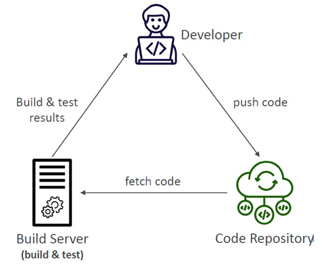
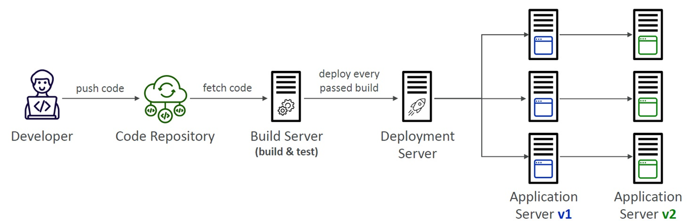
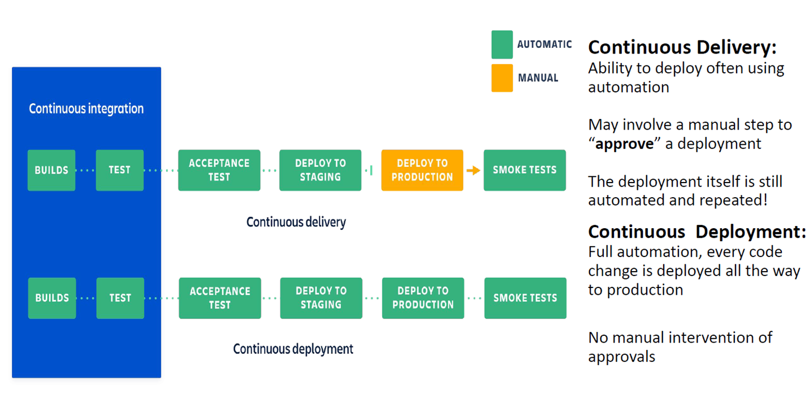
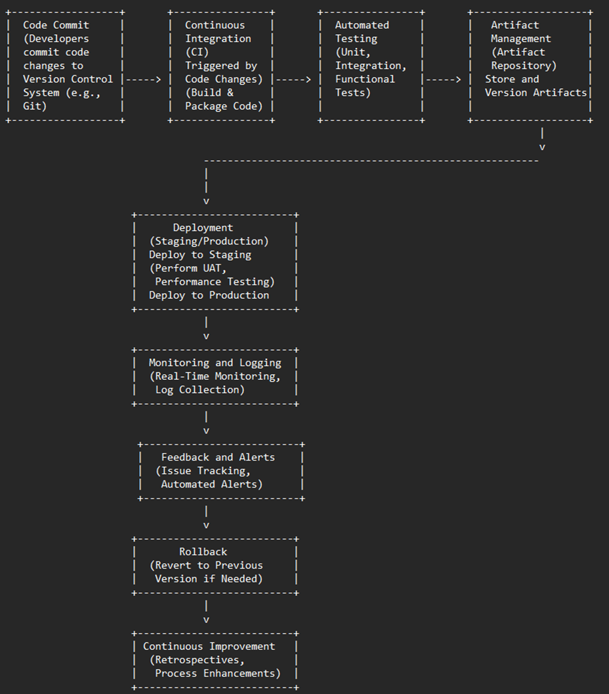

# CICD Concepts

## Challenges with Manual Deployment

### Merge Conflicts
Multiple developers pushing simultaneously can overwrite each other’s code.

### Human Errors
Mistakes such as deploying to the wrong server, using the wrong branch, or missing files during deployment can occur.

### Production Issues
Manual deployments can lead to downtime or broken features if bugs are introduced.

### Rollback Difficulty
Reverting a failed deployment manually is time-consuming and error-prone.

### “It Works on My Machine” Problem
Code may function locally but fail in other environments due to:
- Differences in OS, libraries, or versions
- Mismatched environment variables or configuration
- Missing dependencies

This often results in production bugs and wasted debugging time.

### Manual Deployment Frequency
For a small team (e.g., 5 developers), safe manual deployment is typically limited to 1–2 times per day.

## Continuous Integration
- Developers push the code to a code repository often (e.g., GitHub, CodeCommit, Bitbucket…)
- A testing/build server checks the code as soon as it’s pushed (CodeBuild, Jenkins CI, CircleCI, Travis CI...)
- The developer gets feedback about the tests and checks that have passed/failed
- Find bugs early, then fix bugs
- Deliver faster as the code is tested

    

## Continuous Delivery
- UI and application-specific artifacts are made available on web servers
- Ensures that the software can be released reliably whenever needed
- Ensures deployments happen often and are quick
- Shift away from “one release every 3 months” to “5 releases a day”
- Usually involves automated deployment (e.g., CodeDeploy, Jenkins CD, Spinnaker...)

    

## Continuous Deployment
- Every change that passes automated tests is automatically deployed to production
- Eliminates manual intervention for deployment
- Provides rapid feedback from production environment
- Reduces risk by deploying smaller changes frequently
- Enables faster innovation and quicker response to customer needs
- Requires robust automated testing and monitoring to ensure stability

## Continuous Delivery & Continuos Deployment

## CI/CD Workflow

1. **Code Commit**: Developers commit code changes to the version control system (e.g., Git).
2. **Continuous Integration (CI)**: The CI server detects code changes and triggers the build process. The code is built and packaged into deployable artifacts.
3. **Automated Testing**: Automated tests (unit, integration, functional) validate the code to ensure it meets quality standards and does not introduce new issues.
4. **Artifact Management**: Successful builds are stored in an artifact repository. Artifacts are versioned and managed for deployment.
5. **Deployment**: The application is deployed to a staging environment for additional testing (UAT, performance testing). Once staging tests pass, the application is deployed to production.
6. **Monitoring and Logging**: Monitor application performance, availability, and health in production. Collect and analyze logs for troubleshooting and insights.
7. **Feedback and Alerts**: Track issues and set up alerts for any problems during or after deployment. Gather feedback from monitoring and users.
8. **Rollback**: If a deployment causes issues, revert to a previous stable version to address critical problems promptly.
9. **Continuous Improvement**: Conduct retrospectives to review the CI/CD process and implement improvements based on feedback and lessons learned.

## CI/CD Tools

| Category | Tools |
|----------|-------|
| Source Code Repository | GitHub, Bitbucket, GitLab, CodeCommit |
| CI Servers | Jenkins, CircleCI, Travis CI, GitHub Actions, CodeBuild |
| CD / Deployment | Jenkins CD, CodeDeploy, Spinnaker, Octopus Deploy |
| Containerization / Orchestration | Docker, Kubernetes, Amazon ECS |
| Monitoring / Feedback | Prometheus, Grafana, ELK Stack, CloudWatch |