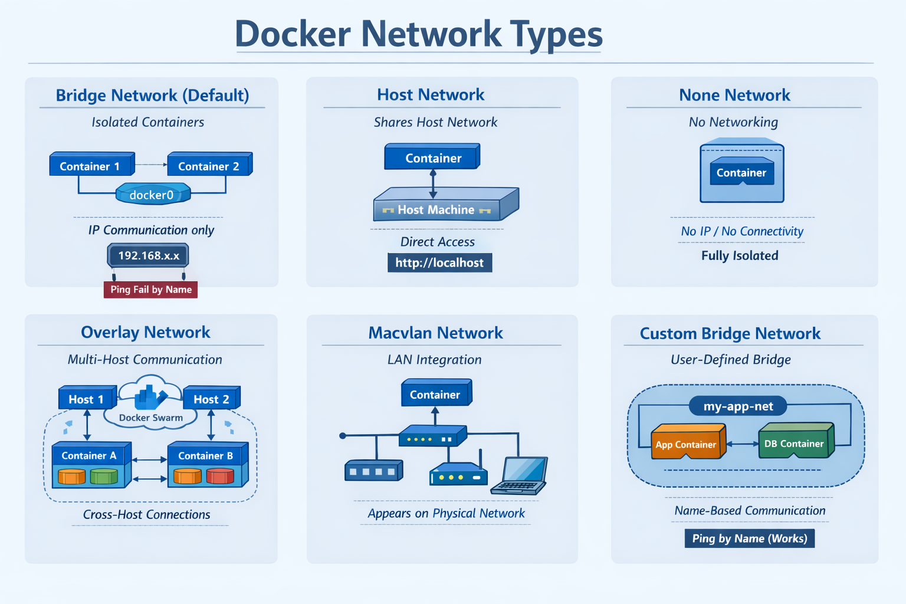

# Docker Networking 

## What is Docker Networking?

Docker networking allows containers to communicate:

- With each other  
- With the host machine  
- Across multiple Docker hosts  

Each container runs in isolation. Networks allow controlled communication between them.

---

## List Docker Networks

```bash
docker network ls
```

## Inspect Docker Netwoks

```bash
docker network inspect bridge
```

## Docker Network Types

Docker provides different network drivers to control how containers communicate.


1. **Bridge Network**

- Default network driver
- Used for standalone containers
- Creates a virtual bridge (docker0)
- Containers get private IP addresses
- Containers can communicate by IP
- Cannot communicate by name (default bridge)

  **Example**

    ```bash
    docker run -dit --name c1 alpine sh
    docker run -dit --name c2 alpine sh
    ```
    - Ping by name (fails)
    ```bash
    docker exec -it c2 ping c1
    ```
    - Ping by IP (works)
    ```bash
    docker inspect c1
    docker exec -it c2 ping <c1-ip>
    ```

2. **Host Network**
- Container shares host’s network stack
- No isolation between host and container network
- No port mapping required

    **Example**
    ```bash
    docker run --network host nginx
    ```
    `Access service at: http://localhost`

3. **None Network**
- Disables networking completely
- No IP address
- No external communication
- Used for secure or isolated workloads


4. **Overlay Network**
- Enables communication between containers on different hosts
- Used in Docker Swarm
- Multi-host communication
- Built-in DNS


5. **Macvlan Network**
- Assigns real MAC address to container
- Container appears as physical device on LAN
- Used for legacy systems

6. **Custom Bridge Network (User-Defined Bridge)**
- User-created Docker network that allows containers on the same host to communicate with each other
- Custom bridge networks provide automatic DNS resolution between containers.
- Containers can communicate by name

    **Example**
    ```bash
    docker network create my-app-net

    docker run -dit --name app --network my-app-net alpine sh
    docker run -dit --name db --network my-app-net alpine sh

    docker exec -it app ping db
    ```
    - Works because both containers are on a user-defined network with DNS enabled.





## Quick Summary

| Network Type   | Scope       | Name Resolution | Use Case               |
| -------------- | ----------- | --------------- | --------------------- |
| Bridge         | Single host | ❌ (default)    | Simple containers     |
| Host           | Single host | N/A             | Performance apps      |
| None           | Single host | ❌              | Isolated workloads    |
| Overlay        | Multi-host  | ✅              | Swarm / Microservices |
| Macvlan        | LAN         | ❌              | Legacy systems        |
| Custom Bridge  | Single host | ✅              | App + DB setups       |